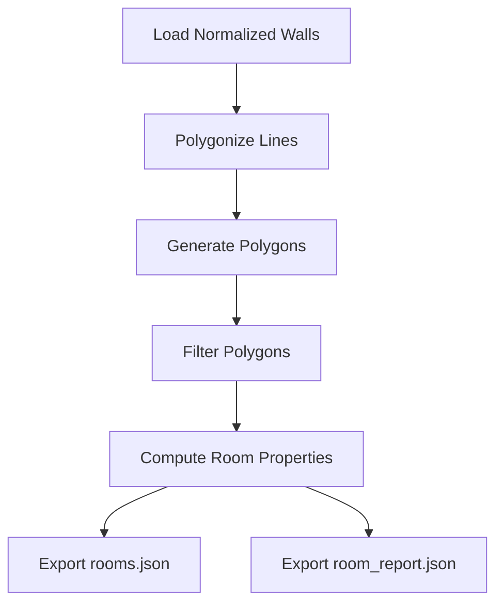

# Room Detection Engine Design

## Overview
- Purpose: Detect enclosed rooms using wall topology, compute area, centroid, confidence, and export results.

## Architecture

## Data Structures
- Room object:
  - id: string
  - wall_ids: list of wall IDs
  - polygon: list of coordinate pairs
  - area: float
  - perimeter: float
  - centroid: list [x, y]
  - confidence_score: float

## Algorithm Flow
1. Load normalized walls from outputs/walls_normalized.json
2. Collect line walls and construct Shapely LineString objects
3. Use polygonize to detect closed polygons
4. For each polygon:
   - Compute area and perimeter
   - Compute centroid
   - Determine confidence based on geometry and proximity to walls
   - Associate with relevant door/window entities if needed
5. Export list of rooms to outputs/rooms.json
6. Generate report with aggregate statistics and save to outputs/room_report.json

## Integration Points
- Coordinate Normalization: Use normalized wall coordinates from coordinate_normalizer.py
- Door/Window Detection: Optionally filter out polygons that contain doors/windows or adjust confidence
- Output Modules: Write JSON files to outputs/ directory

## Testing Strategy
- Unit tests for polygonize boundary detection
- Unit tests for area, centroid calculations
- Integration tests with normalized walls pipeline
- Edge case tests with non-manifold geometries

## Known Limitations
- Assumes walls form valid topological edges
- Sensitive to coordinate precision; may miss small rooms
- Does not handle multi-story or complex split-level rooms
- Confidence scoring is heuristic

## Future Improvements
- Support complex multi-polygon rooms
- Integrate with BIM generation pipeline
- Add IFC export capability
- Enhance confidence scoring with machine learning
- Parallel processing for large datasets

## Sprint Report Outline
- Summary of completed design
- Architecture diagram
- Data flow
- Test plan
- Risks and mitigations
- Next steps: implementation