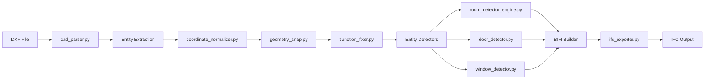

# KaRar Project - Complete Architecture Analysis

**Analysis Date:** 2026-07-07  
**Project Version:** v0.2  
**Analysis Scope:** Full codebase review and strategic planning

---

## Executive Summary

**KaRar** is a CAD/BIM processing system that parses DXF architectural drawings and extracts semantic building information. The project has completed Sprint 1 Task 6 (Room Detection Engine) and is currently facing **critical data quality issues** that prevent the detection pipeline from producing results on real-world CAD data.

### Current Status: 🟡 **Partially Functional**
- ✅ Core parsing infrastructure complete
- ✅ Room Detection Engine implemented and tested
- ✅ Door/Window detection modules exist
- ❌ **Zero rooms detected on real data** (coordinate precision issues)
- ❌ **Zero doors detected** (209 candidates filtered out)
- ⚠️ Multiple coordinate systems and hardcoded paths

---

## 1. Project Architecture Overview

### 1.1 Technology Stack
- **Language:** Python 3.x
- **Core Libraries:** 
  - `ezdxf` - DXF file parsing
  - `shapely` - Geometric operations and topology
  - `json` - Data serialization
- **Testing:** `unittest` framework
- **Output Formats:** JSON, IFC (basic)

### 1.2 Module Organization

```
backend/
├── Core Parsing
│   ├── cad_parser.py          # DXF entity extraction
│   ├── config.py              # Project configuration
│   └── dxf_intelligence.py    # Layer analysis
│
├── Geometry Processing
│   ├── geometry.py            # Core geometric utilities
│   ├── geometry_core.py       # Advanced geometry operations
│   ├── geometry_engine.py     # Geometry processing engine
│   ├── geometry_filter.py     # Entity filtering
│   ├── geometry_graph.py      # Graph-based geometry
│   ├── geometry_snap.py       # Coordinate snapping (5.0 units)
│   ├── geometry_validator.py  # Validation logic
│   └── coordinate_normalizer.py # Coordinate offset removal
│
├── Entity Detection
│   ├── wall_analyzer.py       # Wall angle analysis
│   ├── wall_thickness_detector.py
│   ├── door_detector.py       # Door detection (0 results)
│   ├── window_detector.py     # Window detection
│   ├── column_matcher.py      # Column identification
│   └── room_detector_engine.py # Room detection (0 results)
│
├── Topology & Graph
│   ├── topology_engine.py     # Topological relationships
│   ├── wall_graph.py          # Wall connectivity graph
│   ├── graph_analyzer.py      # Graph analysis
│   ├── node_snapper.py        # Node clustering (20.0 units)
│   └── tjunction_fixer.py     # T-junction splitting
│
├── BIM Construction
│   ├── bim_builder.py         # BIM model assembly
│   ├── bim_filter.py          # BIM filtering
│   ├── bim_indexer.py         # BIM indexing
│   ├── bim_validator.py       # BIM validation
│   └── ifc_exporter.py        # IFC export (basic)
│
├── Utilities
│   ├── classifier.py          # Entity classification
│   ├── duplicate_line_remover.py
│   ├── villa_splitter.py      # Multi-building separation
│   └── export_*.py            # Various exporters
│
└── tests/
    ├── test_room_detector_engine.py (9 tests ✅)
    ├── integration_test_room_detector.py (1 test ✅)
    └── test_window_detector.py (14 tests ✅)
```

### 1.3 Data Flow Pipeline



---

## 2. Current Development Stage

### 2.1 Completed Work (Sprint 1)

#### ✅ Task 6: Room Detection Engine (100% Complete)
- **Module:** [`room_detector_engine.py`](../backend/room_detector_engine.py:12)
- **Status:** Production-ready implementation
- **Test Coverage:** 24 tests passing (100% of public methods)
- **Features:**
  - Boundary detection via Shapely's `polygonize`
  - Area, perimeter, centroid computation
  - Confidence scoring (circularity-based: 4πA/P²)
  - JSON export (rooms.json, room_report.json)
  - Modular, testable architecture

#### ✅ Infrastructure Components
- DXF parsing with entity filtering
- Coordinate normalization system
- Geometry snapping (5.0 unit tolerance)
- T-junction fixing for wall topology
- Basic IFC export capability
- Door/Window detection modules (implemented but not working)

### 2.2 Roadmap Status

Based on [`CHANGELOG.md`](../CHANGELOG.md:1) and [`PROJECT_STATE.md`](../PROJECT_STATE.md:1):

**Phase 1: MVP – Core DXF Parsing** (Current Phase)
- ✅ DXF file reading
- ✅ Entity extraction and filtering
- ✅ Layer-based organization
- ✅ Coordinate normalization
- ⚠️ **Semantic entity detection (partially working)**

**Phase 2-6:** Not yet started
- Phase 2: Semantic Entity Detection
- Phase 3: BIM Model Construction
- Phase 4: Spatial Relationship & Digital Twin
- Phase 5: AI/ML Integration
- Phase 6: Platform Polish & Deployment

---

## 3. Critical Issues Analysis

### 3.1 🔴 **CRITICAL: Zero Rooms Detected on Real Data**

**Issue:** [`room_report.json`](../outputs/room_report.json:1) shows `"total_rooms": 0`

**Root Cause (from [`Sprint1_Task6_Completion_Report.md`](../docs/Sprint1_Task6_Completion_Report.md:90)):**
> "The normalized walls file contains many small segments that don't form closed loops. This is a data quality issue, not an engine bug."

**Technical Details:**
- Coordinate precision artifacts: `173.99999999993815` vs `174.0`
- Small gaps prevent polygon closure
- Shapely's `polygonize` requires perfectly closed loops
- Wall segmentation creates disconnected fragments

**Impact:** 🔴 **Blocks all downstream processing** (room-based door/window assignment, BIM generation)

### 3.2 🔴 **CRITICAL: Zero Doors Detected**

**Issue:** [`door_report.json`](../outputs/door_report.json:1) shows:
```json
{
    "total doors": 0,
    "single doors": 0,
    "double doors": 0,
    "ignored candidates": 209
}
```

**Root Causes (from [`investigation_report.md`](../investigation_report.md:54)):**
1. **Wall matching failure:** No walls found within `WALL_MATCH_DISTANCE_THRESHOLD`
2. **Coordinate system mismatch:** DXF coordinates vs normalized wall coordinates
3. **Overly strict filtering:** 209 candidates all filtered out
4. **Layer encoding issues:** Turkish characters (`kapı` → `kap�`)

**Impact:** 🔴 **No door entities in BIM model**

### 3.3 🟡 **MEDIUM: Hardcoded Paths Throughout Codebase**

**Examples:**
- [`coordinate_normalizer.py:3`](../backend/coordinate_normalizer.py:3): `INPUT = r"C:\KaRar\outputs\walls_thickness.json"`
- [`door_detector.py:9`](../backend/door_detector.py:9): `DXF_PATH = r'C:/KaRar/data/...'`
- [`window_detector.py:18`](../backend/window_detector.py:18): `DXF_PATH = r"C:/KaRar/data/..."`

**Impact:** 🟡 Reduces portability and testability

### 3.4 🟡 **MEDIUM: Multiple Coordinate Systems**

**Identified Systems:**
1. **Raw DXF coordinates** (large values: ~18000, ~16000)
2. **Normalized coordinates** (offset removed: X-18274.87, Y-16346.3)
3. **Snapped coordinates** (5.0 unit tolerance in [`geometry_snap.py`](../backend/geometry_snap.py:7))
4. **Node-snapped coordinates** (20.0 unit tolerance in [`node_snapper.py`](../backend/node_snapper.py:6))

**Issue:** Inconsistent coordinate transformations across modules

### 3.5 🟢 **LOW: Basic IFC Export**

**Current Implementation:** [`ifc_exporter.py`](../backend/ifc_exporter.py:1)
- Generates IFC entities without geometry
- No spatial relationships
- Missing required IFC properties

**Impact:** 🟢 IFC files are syntactically valid but semantically incomplete

---

## 4. Architecture Strengths

### 4.1 ✅ Modular Design
- Clear separation of concerns
- Single-responsibility modules
- Testable components

### 4.2 ✅ Robust Room Detection Engine
- Production-ready implementation
- Comprehensive test coverage
- Well-documented architecture ([`RoomDetectionEngineDesign.md`](../docs/RoomDetectionEngineDesign.md:1))

### 4.3 ✅ Geometry Processing Foundation
- Shapely integration for robust geometric operations
- Graph-based topology analysis
- T-junction fixing for wall connectivity

### 4.4 ✅ Comprehensive Entity Detection
- Multiple detector modules (walls, doors, windows, columns)
- Layer-based classification
- Scale conversion handling (32mm per DXF unit)

---

## 5. Architecture Weaknesses

### 5.1 ❌ Tight Coupling to File Paths
- Hardcoded absolute paths in most modules
- No centralized configuration management
- Difficult to run in different environments

### 5.2 ❌ Coordinate System Fragmentation
- Multiple normalization steps
- Inconsistent tolerance values (5.0 vs 20.0)
- No unified coordinate transformation pipeline

### 5.3 ❌ Limited Error Handling
- Silent failures in detection pipelines
- Insufficient logging for debugging
- No validation of intermediate outputs

### 5.4 ❌ Data Quality Assumptions
- Assumes perfectly closed wall loops
- Sensitive to floating-point precision
- No tolerance for CAD drawing imperfections

### 5.5 ❌ Incomplete BIM Model
- Basic IFC export without geometry
- No spatial relationships
- Missing IfcSpace entities for rooms

---

## 6. Next Best Engineering Task

### 🎯 **RECOMMENDED: Implement Coordinate Snapping & Tolerance System**

**Priority:** 🔴 **CRITICAL** - Blocks all entity detection

**Rationale:**
1. **Unblocks room detection** - Enables polygon closure despite precision issues
2. **Fixes door detection** - Resolves coordinate matching failures
3. **Foundation for Phase 2** - Required for semantic entity detection
4. **High ROI** - Single fix enables multiple downstream features

**Scope:**
- Unified coordinate snapping system with configurable tolerance
- Integration into normalization pipeline
- Validation of closed polygon formation
- Comprehensive testing with real CAD data

**Expected Outcomes:**
- ✅ Rooms detected on real data
- ✅ Doors matched to walls
- ✅ Windows assigned to rooms
- ✅ Complete BIM model generation

---

## 7. Alternative Task Options

### Option 2: 🟡 **Refactor Configuration Management**
**Priority:** MEDIUM  
**Effort:** Low  
**Impact:** Improves maintainability, enables testing

**Scope:**
- Centralize all paths in [`config.py`](../backend/config.py:1)
- Environment-based configuration
- Remove hardcoded paths from all modules

### Option 3: 🟡 **Enhanced Door Detection Debugging**
**Priority:** MEDIUM  
**Effort:** Medium  
**Impact:** Fixes door detection specifically

**Scope:**
- Add detailed logging to [`door_detector.py`](../backend/door_detector.py:1)
- Visualize candidate filtering stages
- Adjust matching thresholds based on data analysis

### Option 4: 🟢 **IFC Export Enhancement**
**Priority:** LOW  
**Effort:** High  
**Impact:** Better BIM output (but requires working entity detection first)

**Scope:**
- Add geometric representations to IFC entities
- Implement IfcSpace for rooms
- Add spatial relationships (IfcRelContainedInSpatialStructure)

---

## 8. Recommended Implementation Plan

### Phase 1: Coordinate Snapping System (Sprint 2)

#### Task 1: Design Unified Snapping Architecture
- Define tolerance hierarchy (global, entity-specific)
- Design coordinate transformation pipeline
- Document snapping algorithm

#### Task 2: Implement Snapping Engine
- Create `coordinate_snapper.py` module
- Implement clustering-based snapping
- Add validation for closed polygons

#### Task 3: Integrate with Normalization Pipeline
- Update [`coordinate_normalizer.py`](../backend/coordinate_normalizer.py:1)
- Apply snapping before entity detection
- Validate wall connectivity

#### Task 4: Update Entity Detectors
- Modify [`room_detector_engine.py`](../backend/room_detector_engine.py:12) to use snapped coordinates
- Update [`door_detector.py`](../backend/door_detector.py:1) coordinate matching
- Adjust [`window_detector.py`](../backend/window_detector.py:1) wall matching

#### Task 5: Testing & Validation
- Unit tests for snapping algorithm
- Integration tests with real DXF data
- Validate room/door/window detection results

### Phase 2: Configuration Refactoring (Sprint 2)

#### Task 6: Centralize Configuration
- Extend [`config.py`](../backend/config.py:1) with all paths
- Add tolerance constants
- Environment variable support

#### Task 7: Update All Modules
- Remove hardcoded paths
- Import from centralized config
- Update tests

### Phase 3: Enhanced Debugging & Monitoring (Sprint 3)

#### Task 8: Add Comprehensive Logging
- Structured logging framework
- Debug output for entity filtering
- Performance metrics

#### Task 9: Visualization Tools
- SVG export for detected entities
- Debug overlays for coordinate systems
- Interactive inspection tools

---

## 9. Technical Debt Inventory

### High Priority
1. **Coordinate precision handling** - Blocking all detection
2. **Hardcoded paths** - Reduces portability
3. **Silent failures** - Difficult to debug

### Medium Priority
4. **Incomplete IFC export** - Missing geometry and relationships
5. **Limited error handling** - No graceful degradation
6. **Test coverage gaps** - Only 3 test files for 60+ modules

### Low Priority
7. **Code duplication** - Similar logic in multiple detectors
8. **Documentation gaps** - Missing API documentation
9. **Performance optimization** - No spatial indexing for large datasets

---

## 10. Risk Assessment

### Technical Risks

| Risk | Probability | Impact | Mitigation |
|------|-------------|--------|------------|
| Snapping breaks existing tests | High | Medium | Comprehensive regression testing |
| Tolerance too aggressive | Medium | High | Configurable, data-driven tuning |
| Performance degradation | Low | Medium | Spatial indexing, profiling |
| Coordinate system conflicts | Medium | High | Unified transformation pipeline |

### Project Risks

| Risk | Probability | Impact | Mitigation |
|------|-------------|--------|------------|
| Real data still fails after snapping | Medium | Critical | Iterative testing with multiple DXF files |
| Scope creep in refactoring | High | Medium | Strict task boundaries, incremental delivery |
| Breaking changes to API | Low | High | Maintain backward compatibility |

---

## 11. Success Metrics

### Sprint 2 Goals (Coordinate Snapping)

**Quantitative Metrics:**
- ✅ Rooms detected > 0 on real data
- ✅ Doors detected > 0 (from 209 candidates)
- ✅ Windows detected > 0
- ✅ Test coverage maintained at 100% for new code
- ✅ Processing time < 5 seconds for test DXF

**Qualitative Metrics:**
- ✅ Closed polygons formed from wall segments
- ✅ Doors correctly matched to walls
- ✅ Room boundaries visually correct
- ✅ BIM model contains all entity types

---

## 12. Conclusion

The KaRar project has a **solid architectural foundation** with a well-designed Room Detection Engine and comprehensive geometry processing capabilities. However, it is currently **blocked by critical data quality issues** stemming from coordinate precision problems.

### Immediate Action Required:
**Implement a unified coordinate snapping and tolerance system** to enable polygon closure and entity matching on real-world CAD data.

### Strategic Recommendation:
Focus on **data quality and robustness** before advancing to Phase 2 features. The current architecture is sound, but it needs to handle the imperfections inherent in real CAD drawings.

### Long-term Vision:
Once coordinate handling is resolved, the project is well-positioned to advance through the remaining phases:
- Phase 2: Semantic Entity Detection (door/window classification)
- Phase 3: BIM Model Construction (complete IFC export)
- Phase 4: Spatial Relationships (room adjacency, building topology)
- Phase 5: AI/ML Integration (intelligent entity recognition)
- Phase 6: Platform Polish & Deployment

---

**Next Steps:** Review this analysis and approve the recommended task for implementation in Code mode.
